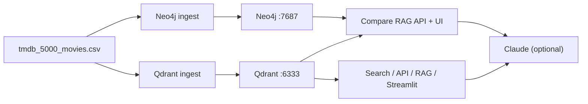

# Movie Recommendation System

Semantic movie search and RAG (Retrieval-Augmented Generation) built on the [TMDB 5000 Movies](https://www.kaggle.com/datasets/tmdb/tmdb-movie-metadata) dataset. The project compares two vector backends — **Qdrant** (purpose-built vector DB) and **Neo4j** (graph DB with vector search) — using the same embedding model and aligned document text.

## Features

- **Qdrant stack** — semantic search, keyword/filter search, similar-movie recommendations, and Claude-powered RAG
- **Neo4j stack** — movie knowledge graph (genres, keywords, companies, countries, languages) plus vector search on `Movie.embedding`
- **Compare RAG** — FastAPI + Streamlit UI to run the same query against both stores side-by-side
- **Graph enrichment** — Neo4j results show budget, keywords, production metadata, and drill-down similar movies via shared keywords

## Architecture



Both pipelines embed the same text per movie:

```text
{title} ({year})Genres: {genres}:{overview}
```

| Setting | Value |
|---------|-------|
| Embedding model | `all-MiniLM-L6-v2` (384 dimensions) |
| Qdrant collection | `movies` |
| Neo4j vector index | `movieEmbeddingsIndex` on `Movie.embedding` |

## Prerequisites

- Python 3.14+ (see `pyproject.toml`)
- [uv](https://docs.astral.sh/uv/) (recommended) or pip
- Docker (for Qdrant; Neo4j can be local or Docker)
- Dataset at `data/tmdb_5000_movies.csv` (included in repo)

### Start databases

**Qdrant**

```powershell
docker run -d --name qdrant -p 6333:6333 qdrant/qdrant
```

**Neo4j** (example with Docker)

```powershell
docker run -d --name neo4j `
  -p 7474:7474 -p 7687:7687 `
  -e NEO4J_AUTH=neo4j/your-password `
  neo4j:latest
```

## Setup

```powershell
git clone <repo-url>
cd movie-recommendation-system

uv sync
# or: pip install -e .
```

Create a `.env` file in the project root (gitignored):

```env
ANTHROPIC_API_KEY=sk-ant-...

NEO4J_URI=bolt://localhost:7687
NEO4J_USER=neo4j
NEO4J_PASSWORD=your-password

# optional overrides
QDRANT_URL=http://localhost:6333
```

`ANTHROPIC_API_KEY` is required for generated answers in RAG flows. Retrieval works without it.

## Ingest data

Run both ingests from the project root so paths resolve correctly.

**Qdrant** (~4,800 movies with overviews)

```powershell
python .\src\movie_recommender\ingest.py
```

**Neo4j** (movies + graph relationships + embeddings)

```powershell
python .\src\neo4j\ingest.py
```

Re-run both after changing embedding text or chunk strategy so Qdrant and Neo4j stay aligned.

## Running the apps

All commands assume the project root as the working directory.

### Qdrant — Movie Recommender (Streamlit)

Search, ingest UI, similar movies, and RAG in one app.

```powershell
python -m streamlit run .\src\movie_recommender\app.py
```

### Qdrant — REST API

```powershell
python -m uvicorn movie_recommender.api:app --app-dir src --reload --port 8001
```

| Endpoint | Description |
|----------|-------------|
| `GET /health` | Health check |
| `GET /search/semantic` | Vector similarity search |
| `GET /search/keyword` | Text match on overview/title |
| `GET /search/filtered` | Semantic search with metadata filters |
| `GET /search/similar` | Recommend movies similar to a given movie |
| `GET /search/threshold` | Semantic search with minimum score |

Docs: http://localhost:8001/docs

### Qdrant — CLI RAG demo

```powershell
python .\src\movie_recommender\rag.py
```

Runs a fixed set of test questions against Qdrant + Claude.

### Compare RAG — FastAPI

Side-by-side Neo4j vs Qdrant retrieval (optional Claude answer).

```powershell
python -m uvicorn compare.compare_rag:app --app-dir src --reload --port 8000
```

| Endpoint | Description |
|----------|-------------|
| `GET /health` | Health check |
| `POST /search/neo4j` | Neo4j vector RAG |
| `POST /search/qdrant` | Qdrant vector RAG |
| `POST /search/compare` | Both stores in one response |

Docs: http://localhost:8000/docs

### Compare RAG — Streamlit UI

```powershell
python -m streamlit run .\src\compare\streamlit_app.py
```

Modes: **Compare both**, **Neo4j only**, **Qdrant only**. Neo4j results include **Details** (release year, genres, ratings from the graph) and **Graph extras** (keywords, companies, similar movies with drill-down).

> On Windows, use `python -m streamlit run ...` rather than calling `streamlit.exe` directly if Application Control policies block the shim.

## Project structure

```text
movie-recommendation-system/
├── data/
│   └── tmdb_5000_movies.csv      # TMDB dataset
├── src/
│   ├── movie_recommender/        # Qdrant-based recommender
│   │   ├── ingest.py             # Load CSV → Qdrant
│   │   ├── search.py             # Qdrant search helpers
│   │   ├── api.py                # FastAPI REST API
│   │   ├── rag.py                # Qdrant + Claude RAG
│   │   └── app.py                # Streamlit UI
│   ├── neo4j/
│   │   └── ingest.py             # Load CSV → Neo4j graph + embeddings
│   └── compare/
│       ├── compare_rag.py        # Compare API (Neo4j vs Qdrant)
│       └── streamlit_app.py      # Compare UI with graph drill-down
├── pyproject.toml
└── .env                          # secrets (not committed)
```

## Qdrant vs Neo4j in this project

| | Qdrant | Neo4j |
|---|--------|--------|
| Primary strength | Fast vector search, simple ops, `recommend()` API | Graph relationships and traversal |
| Extra metadata | Flat payload (title, year, genres, rating, overview) | Keywords, companies, countries, languages, budget, revenue |
| Ingest complexity | Low | Higher (nodes + relationships + vector index) |
| Best for | RAG, semantic search, production vector workloads | Hybrid retrieval + explainable graph links |

With aligned embeddings, semantic retrieval results should be similar. Neo4j adds value through graph extras (e.g. “similar via shared keywords”) that Qdrant does not model natively.

## Troubleshooting

| Issue | Fix |
|-------|-----|
| Port 8000 in use | Stop the other process or use a different port (`--port 8002`) |
| Qdrant connection refused | Ensure Docker container is running on port 6333 |
| Neo4j auth failed | Check `NEO4J_PASSWORD` in `.env` matches your instance |
| Empty genres in Neo4j Details | Re-run `src/neo4j/ingest.py`; genres come from `IN_GENRE` relationships |
| Collection/index not found | Run the corresponding ingest script first |
| No Claude answer | Set `ANTHROPIC_API_KEY` in `.env` |

## License

Add your license here.
